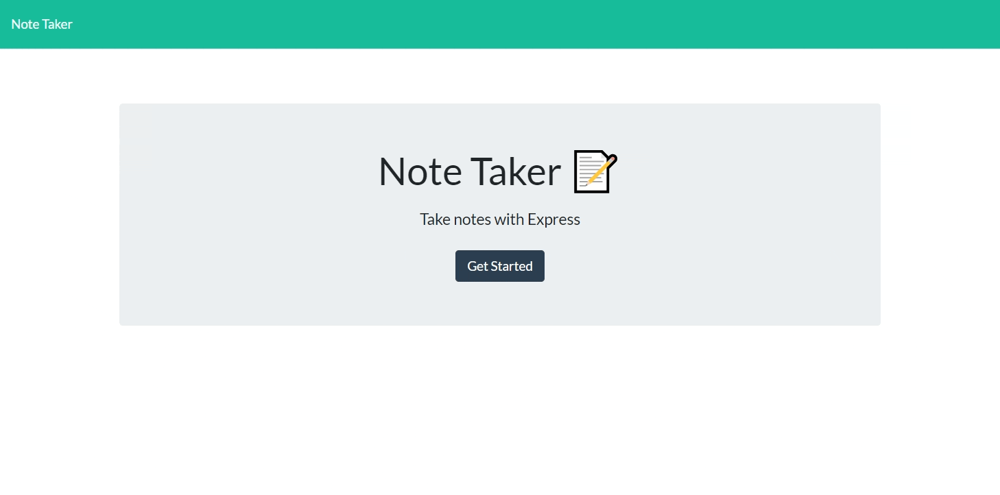

# Note Taker

## Table of Contents

* [Description](#description)
* [Installation](#installation)
* [Usage](#usage)
* [Testing](#testing)
* [Contributions](#contributions)
* [Additional Information](#additional-information)

## [Description:](#table-of-contents)
Note Taker is a lightweight in-browser application that can be used to write, save, and delete notes.

*User Story*
```
AS A small business owner
I WANT to be able to write and save notes
SO THAT I can organize my thoughts and keep track of tasks I need to complete
```

## [Installation:](#table-of-contents)
After cloning this repository, install the required dependencies with the following commands (Recommended):
```
npm install
```

Or to individually add the NPM packages:
```
npm i jest
```
```
npm i uniqid
```

## [Usage:](#table-of-contents)
The front-end application is hosted/deployed to Heroku. The site can be viewed here:

[Note Taker](https://note-taker0642.herokuapp.com/)



* Navigate through the landing page to the main Notes page by clicking **Get Started**
* Clicking on the **plus icon**  on the top right allows a user to add a new note, with a custom title and text in the text areas provided
* Clicking the **save icon** on the top right will save your new note, which in turn adds it to the list of notes on the left
* Clicking on a saved note will bring it up on the right hand column to view details
* User can delete a note by clicking on the red **trash icon** next to the saved note's title in the left hand column

## [Testing:](#table-of-contents)
[Jest](https://jestjs.io/) used in testing note creation

[Insomnia](https://insomnia.rest/) for testing endpoint functionality

## [Contributions:](#table-of-contents)
Contributors and feedback always welcome!

## [Additional Information:](#table-of-contents)
Note Taker is a project created with a heavy focus on **Express.js** server creation/handling, and creating API routes.

Starter code provided by *GWU 2022 Coding Bootcamp*


_If you have any questions about the application, would like to become a contributor, or to check out more of my work, feel free to contact me:_

[GitHub](https://github.com/blindsweatyhansolo)